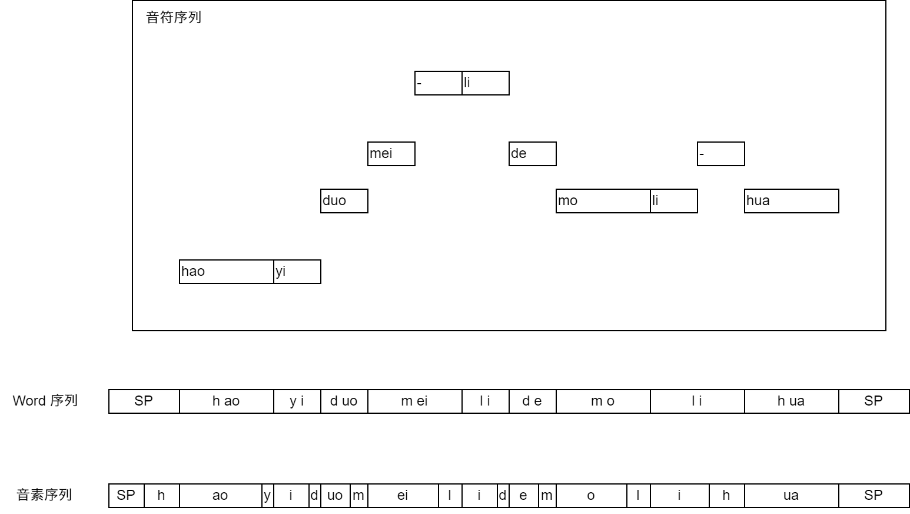

# DiffSinger 合成流程

## 1. 音素时长

### 音符、音素

#### 音符序列

用户在歌声合成编辑器中输入音符序列，每个音符具有以下属性。

- `lyric`：歌词
- `keyNum`：音高
- `pos`：起始 tick
- `length`：长度

特殊歌词：
- `-`：延续上一个音节
- `+`：自动分配音节
- `SP`：无声休止符
- `AP`：换气音符

#### Word 序列

音符序列会被编辑器转换为 Word 序列，这是一种中间形态。

Word 序列是一组连续的紧密相连的词块，词块中有一个或多个音素（音素子序列），词块的起始和终止位置对应一个卡拍点。

音符序列转换为 Word 序列的过程，主要是将音符内的歌词转换为音素子序列，还伴随着以下特殊规则：
- 所有`-`符号与其延续的歌词合并
- 所有`+`符号与其分配音节的歌词被替换为实际的音节
- 存在短暂间隔的音符之间填充`SP`
- 一个音符片段前后添加隐式`SP`

#### 音素序列

Word 序列经过音素时长推理模块（duration）的预测后，转换为音素序列，音素序列中每个音素块只包含一个音素。音素的符号由声库定义。

    

### 音素时长推理模块

TODO

## 2. 音高

## 3. 声学

### 